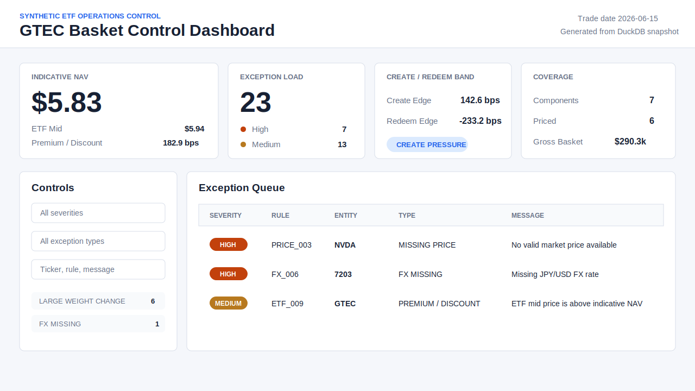

# ETF Basket Control Engine

`etf-basket-control-engine` is a Python-based portfolio project that simulates an institutional ETF creation/redemption basket control workflow for a fictional US-listed multi-currency equity ETF, `GTEC`.

The project uses only synthetic data. It does not connect to Bloomberg, Refinitiv, JPM, Virtu, DTCC, NSCC, exchanges, or any live market data provider. It is a realistic simulation of ETF operations controls, not a production trading system, and it does not use Streamlit.

## Dashboard Preview

The interactive dashboard can be hosted directly from the repository with GitHub Pages. The README can show a static preview image, while the live dashboard runs as plain HTML, CSS, and JavaScript from the `docs/` folder.



Live dashboard URL:

```text
https://beep-beep-creepy-sheep.github.io/etf-basket-control-engine/
```

No local deployment is required for viewers once the repository is pushed to GitHub and Pages is enabled.

## Business Context

ETF operations teams review daily Portfolio Composition Files (PCFs), holdings, market prices, FX rates, ETF quotes, and corporate action files to make sure create/redeem baskets are valued correctly and operational breaks are escalated. Small data issues can distort indicative NAV, premium/discount analysis, cash balancing, or create/redeem decisions.

This project models that workflow as a local batch-control pipeline:

1. Ingest synthetic PCF, holdings, prior holdings, prices, FX, corporate actions, and ETF quote files.
2. Validate and normalize input schemas.
3. Apply a configurable price waterfall.
4. Convert local values to USD and value basket components.
5. Calculate indicative NAV, ETF premium/discount, and simplified create/redeem cost-band signals.
6. Detect exceptions across pricing, FX, reconciliation, drift, and corporate actions.
7. Store raw, intermediate, and final outputs in embedded DuckDB.
8. Generate daily audit-ready Excel and HTML exception reports.

DuckDB is embedded and creates a local `.duckdb` file. No external database server, Docker, Airflow, Postgres, or MySQL is required.

## Architecture

```text
data/raw/*.csv
   -> pydantic schema validation
   -> DuckDB raw tables and run audit
   -> price waterfall / FX checks / basket valuation
   -> reconciliation and corporate-action controls
   -> DuckDB output tables
   -> Excel and HTML exception reports
```

Key modules:

- `src/etfctl/ingest`: CSV loading, Pydantic validation, file hashing, run audit.
- `src/etfctl/pricing`: price waterfall, FX conversion, basket valuation, iNAV, premium/discount, cost-band signals.
- `src/etfctl/controls`: rule-driven exceptions for price, FX, drift, ETF dislocation, and corporate actions.
- `src/etfctl/reconcile`: PCF versus holdings checks.
- `src/etfctl/report`: Excel and HTML reporting.
- `src/etfctl/storage`: DuckDB DDL and client wrapper.

## Sample Data

The synthetic `GTEC` basket includes:

- US components: `AAPL`, `MSFT`, `NVDA`
- Japanese component: `7203`
- European components: `ASML`, `SAP`
- Cash-in-lieu component: `GTEC_CASH`
- Missing primary price with secondary fallback
- Completely missing price
- Stale price
- Missing/stale FX checks
- Stock split and dividend scenarios
- Basket drift versus prior holdings
- Large ETF premium/discount scenario

## Methodology And Formulas

Price waterfall priority:

1. Manual override, if present
2. Valid primary price
3. Valid secondary price
4. Valid exchange close
5. Prior/stale available price only when no current source is valid, flagged as stale

Basket valuation:

```text
local_market_value = basket_quantity * selected_price
usd_market_value = local_market_value * fx_to_usd
component_weight = usd_market_value / total_basket_market_value
```

ETF valuation:

```text
gross_basket_value = sum(usd_market_value)
net_basket_value = gross_basket_value + estimated_cash + balancing_amount + accrued_dividend
indicative_nav = net_basket_value / creation_unit_size
```

Premium/discount:

```text
mid_price = (bid + ask) / 2
premium_discount_bps = (mid_price / indicative_nav - 1) * 10000
```

Simplified create/redeem cost band:

```text
create_edge_bps = ((etf_bid - indicative_nav) / indicative_nav) * 10000 - create_cost_bps
redeem_edge_bps = ((indicative_nav - etf_ask) / indicative_nav) * 10000 - redeem_cost_bps
```

The cost-band signal is conservative operational language. It should not be interpreted as a guaranteed arbitrage opportunity.

## Exception Types

The engine produces normalized exceptions with:

```text
run_id, trade_date, etf_ticker, entity_type, entity_id, rule_id,
exception_type, severity, message, evidence, created_at
```

Implemented exception types include:

- `MISSING_PRICE`
- `STALE_PRICE`
- `PRIMARY_PRICE_MISSING`
- `PRICE_VENDOR_DIFF`
- `FX_MISSING`
- `FX_STALE`
- `CURRENCY_MISMATCH`
- `LARGE_PREMIUM_DISCOUNT`
- `LARGE_WEIGHT_CHANGE`
- `NEW_COMPONENT`
- `REMOVED_COMPONENT`
- `MISSING_PCF_COMPONENT`
- `MISSING_HOLDINGS_COMPONENT`
- `QUANTITY_MISMATCH`
- `IDENTIFIER_MISMATCH`
- `CORPORATE_ACTION_MISMATCH`
- `DIVIDEND_CASH_COMPONENT_CHECK`

Severity is configured in `config/rules.yaml`.

## Install

```bash
pip install -e ".[dev]"
```

## Run

```bash
etfctl init-db --db storage/etf_control.duckdb
etfctl ingest --date 2026-06-15 --db storage/etf_control.duckdb
etfctl run-controls --date 2026-06-15 --db storage/etf_control.duckdb
etfctl report --date 2026-06-15 --db storage/etf_control.duckdb --output reports/
```

Or run the full pipeline:

```bash
etfctl run-all --date 2026-06-15 --db storage/etf_control.duckdb --output reports/
```

Generate the static browser dashboard data:

```bash
etfctl dashboard --date 2026-06-15 --db storage/etf_control.duckdb --output web/public/data
```

For a GitHub Pages-ready dashboard, write the same static snapshot to `docs/data`:

```bash
etfctl dashboard --date 2026-06-15 --db storage/etf_control.duckdb --output docs/data
```

The repository includes `.github/workflows/pages.yml`, which publishes the static `docs/` dashboard to GitHub Pages on pushes to `main`. Viewers can open the Pages URL directly and do not need Python, DuckDB, Streamlit, Node, or a local server.

Optional local preview:

```bash
python -m http.server 8000 --directory web/public
```

Open `http://localhost:8000` to view the user-friendly control dashboard. The frontend is plain HTML, CSS, and JavaScript; it does not use Streamlit or require a Node build step.

Module execution is also supported:

```bash
python -m etfctl.cli run-all --date 2026-06-15 --db storage/etf_control.duckdb --output reports/
```

Expected generated files:

```text
storage/etf_control.duckdb
reports/ETF_Exception_Report_2026-06-15.xlsx
reports/ETF_Exception_Report_2026-06-15.html
web/public/data/dashboard_2026-06-15.json
docs/data/dashboard_2026-06-15.json
```

Generated databases and reports are ignored by git except for `.gitkeep` placeholders.

## Reports

The Excel report includes:

- `Summary`
- `ETF Valuation`
- `Basket Valuation`
- `Selected Prices`
- `FX Checks`
- `Drift Checks`
- `Exceptions`
- `Run Audit`

The HTML report includes summary cards, ETF valuation, top exceptions, and run audit information.

## Tests

```bash
pytest
```

The test suite covers price waterfall behavior, missing/stale price exceptions, FX exceptions, iNAV, premium/discount, create/redeem cost-band signals, corporate-action checks, basket drift, reconciliation breaks, and YAML-driven severity mapping.

## Limitations

- Synthetic sample data only.
- No live vendor, exchange, broker, clearing, or index-provider feeds.
- No order management, execution, settlement, or trading integration.
- Simplified corporate-action and arbitrage-band logic.
- Designed as a portfolio simulation/prototype, not production control software.

## Resume Bullet Examples

Built a Python-based ETF basket control engine simulating institutional create/redeem workflows, including synthetic PCF ingestion, price and FX waterfall selection, basket valuation, premium/discount analysis, corporate-action checks, and audit-ready exception reporting.

Developed a DuckDB-backed ETF operations control pipeline that validates synthetic PCF, holdings, market price, FX, and corporate action files; detects stale pricing inputs, basket drift, and reconciliation breaks; and generates daily Excel and HTML exception reports.

Implemented configurable ETF pricing controls using Python, DuckDB, Typer, Pydantic, and pytest, with rule-driven exception severity, run-level audit trails, and automated validation tests.
